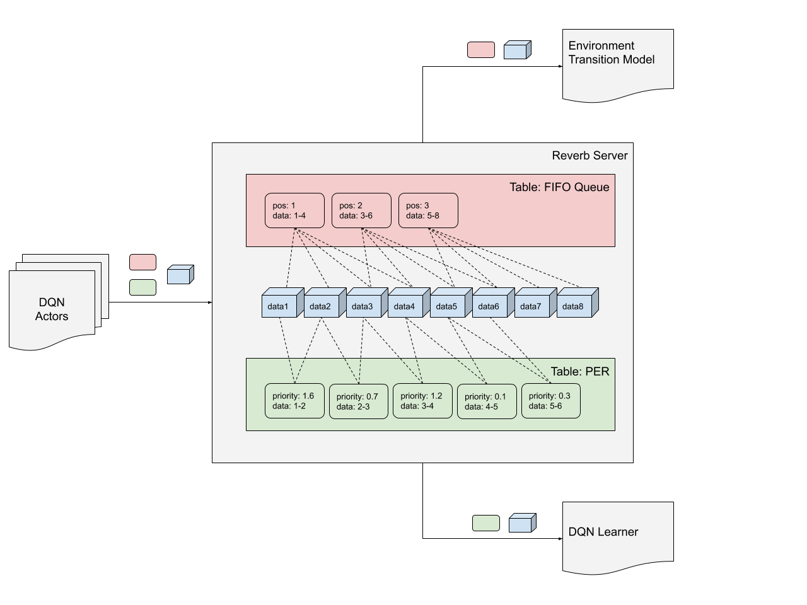

# Reverb

[](https://badge.fury.io/py/dm-reverb)

Reverb is an efficient and easy-to-use data storage and transport system
designed for machine learning research. Reverb is primarily used as an
experience replay system for distributed reinforcement learning algorithms but
the system also supports multiple data structure representations such as FIFO,
LIFO, and priority queues.

## Table of Contents

-   [Installation](#installation)
-   [Quick Start](#quick-start)
-   [Detailed Overview](#detailed-overview)
    -   [Tables](#tables)
    -   [Item Selection Strategies](#item-selection-strategies)
    -   [Rate Limiting](#rate-limiting)
    -   [Sharding](#sharding)
    -   [Checkpointing](#checkpointing)
-   [Citation](#citation)

## Installation

Please keep in mind that Reverb is not hardened for production use, and while we
do our best to keep things in working order, things may break or segfault.

> :warning: Reverb currently only supports Linux based OSes.

The recommended way to install Reverb is with `pip`. We also provide instructions
to build from source using the same docker images we use for releases.

TensorFlow can be installed separately or as part of the `pip` install.
Installing TensorFlow as part of the install ensures compatibility.

```shell
$ pip install dm-reverb[tensorflow]

# Without Tensorflow install and version dependency check.
$ pip install dm-reverb
```

### Nightly builds

[](https://badge.fury.io/py/dm-reverb-nightly)

```shell
$ pip install dm-reverb-nightly[tensorflow]

# Without Tensorflow install and version dependency check.
$ pip install dm-reverb-nightly

```

### Debug builds

Starting with version 0.6.0, debug builds of Reverb are uploaded to Google Cloud
Storage. The builds can be downloaded or installed directly via `pip` following
the patterns below. `gsutils` can be used to navigate the directory structure
to ensure the files are there, e.g.
`gsutil ls gs://rl-infra-builds/dm_reverb/builds/dbg`. To build your own debug
binary, see the
[build instructions](https://github.com/deepmind/reverb/tree/master/reverb/pip_package#create-a-stable-reverb-release).

For Python 3.7:

```shell
$ export reverb_version=0.8.0
# Python 3.7
$ export python_version=37
$ pip install https://storage.googleapis.com/rl-infra-builds/dm_reverb/builds/dbg/$reverb_version/dm_reverb-$reverb_version-cp$python_version-cp${python_version}m-manylinux2010_x86_64.whl
```

For python 3.8 and 3.9 follow this pattern:

```shell
$ export reverb_version=0.8.0
# Python 3.9
$ export python_version=39
$ pip install https://storage.googleapis.com/rl-infra-builds/dm_reverb/builds/dbg/$reverb_version/dm_reverb-$reverb_version-cp$python_version-cp$python_version-manylinux2010_x86_64.whl
```

### Build from source

[This guide](reverb/pip_package/README.md#how-to-develop-and-build-reverb-with-the-docker-containers)
details how to build Reverb from source.

## Quick Start

Starting a Reverb server is as simple as:

```python
import reverb

server = reverb.Server(tables=[
    reverb.Table(
        name='my_table',
        sampler=reverb.selectors.Uniform(),
        remover=reverb.selectors.Fifo(),
        max_size=100,
        rate_limiter=reverb.rate_limiters.MinSize(1)),
    ],
)
```

Create a client to communicate with the server:

```python
client = reverb.Client(f'localhost:{server.port}')
print(client.server_info())
```

Write some data to the table:

```python
# Creates a single item and data element [0, 1].
client.insert([0, 1], priorities={'my_table': 1.0})
```

An item can also reference multiple data elements:

```python
# Appends three data elements and inserts a single item which references all
# of them as {'a': [2, 3, 4], 'b': [12, 13, 14]}.
with client.trajectory_writer(num_keep_alive_refs=3) as writer:
  writer.append({'a': 2, 'b': 12})
  writer.append({'a': 3, 'b': 13})
  writer.append({'a': 4, 'b': 14})

  # Create an item referencing all the data.
  writer.create_item(
      table='my_table',
      priority=1.0,
      trajectory={
          'a': writer.history['a'][:],
          'b': writer.history['b'][:],
      })

  # Block until the item has been inserted and confirmed by the server.
  writer.flush()
```

The items we have added to Reverb can be read by sampling them:

```python
# client.sample() returns a generator.
print(list(client.sample('my_table', num_samples=2)))
```

Continue with the
[Reverb Tutorial](https://github.com/deepmind/reverb/tree/master/examples/demo.ipynb)
for an interactive tutorial.

## Detailed overview

Experience replay has become an important tool for training off-policy
reinforcement learning policies. It is used by algorithms such as
[Deep Q-Networks (DQN)][DQN], [Soft Actor-Critic (SAC)][SAC],
[Deep Deterministic Policy Gradients (DDPG)][DDPG], and
[Hindsight Experience Replay][HER], ... However building an efficient, easy to
use, and scalable replay system can be challenging. For good performance Reverb
is implemented in C++ and to enable distributed usage it provides a gRPC service
for adding, sampling, and updating the contents of the tables. Python clients
expose the full functionality of the service in an easy to use fashion.
Furthermore native TensorFlow ops are available for performant integration with
TensorFlow and `tf.data`.

Although originally designed for off-policy reinforcement learning, Reverb's
flexibility makes it just as useful for on-policy reinforcement -- or even
(un)supervised learning. Creative users have even used Reverb to store and
distribute frequently updated data (such as model weights), acting as an
in-memory light-weight alternative to a distributed file system where each table
represents a file.

### Tables

A Reverb `Server` consists of one or more tables. A table holds items, and each
item references one or more data elements. Tables also define sample and
removal [selection strategies](#item-selection-strategies), a maximum item
capacity, and a [rate limiter](#rate-limiting).

Multiple items can reference the same data element, even if these items exist in
different tables. This is because items only contain references to data elements
(as opposed to a copy of the data itself). This also means that a data element
is only removed when there exists no item that contains a reference to it.

For example, it is possible to set up one Table as a Prioritized Experience
Replay (PER) for transitions (sequences of length 2), and another Table as a
(FIFO) queue of sequences of length 3. In this case the PER data could be used
to train DQN, and the FIFO data to train a transition model for the environment.



Items are automatically removed from the Table when one of two conditions are
met:

1.  Inserting a new item would cause the number of items in the Table to exceed
    its maximum capacity. Table's removal strategy is used to determine which
    item to remove.

1.  An item has been sampled more than the maximum number of times permitted by
    the Table's rate limiter. Such item is deleted.

Data elements not referenced anymore by any item are also deleted.

Users have full control over how data is sampled and removed from Reverb
tables. The behavior is primarily controlled by the
[item selection strategies](#item-selection-strategies) provided to the `Table`
as the `sampler` and `remover`. In combination with the
[`rate_limiter`](#rate-limiting) and `max_times_sampled`, a wide range of
behaviors can be achieved. Some commonly used configurations include:

**Uniform Experience Replay**

A set of `N=1000` most recently inserted items are maintained. By setting
`sampler=reverb.selectors.Uniform()`, the probability to select an item is the
same for all items. Due to `reverb.rate_limiters.MinSize(100)`, sampling
requests will block until 100 items have been inserted. By setting
`remover=reverb.selectors.Fifo()` when an item needs to be removed the oldest
item is removed first.

```python
reverb.Table(
     name='my_uniform_experience_replay_buffer',
     sampler=reverb.selectors.Uniform(),
     remover=reverb.selectors.Fifo(),
     max_size=1000,
     rate_limiter=reverb.rate_limiters.MinSize(100),
)
```

Examples of algorithms that make use of uniform experience replay include [SAC]
and [DDPG].

**Prioritized Experience Replay**

A set of `N=1000` most recently inserted items. By setting
`sampler=reverb.selectors.Prioritized(priority_exponent=0.8)`, the probability
to select an item is proportional to the item's priority.

Note: See [Schaul, Tom, et al.][PER] for the algorithm used in this
implementation of Prioritized Experience Replay.

```python
reverb.Table(
     name='my_prioritized_experience_replay_buffer',
     sampler=reverb.selectors.Prioritized(0.8),
     remover=reverb.selectors.Fifo(),
     max_size=1000,
     rate_limiter=reverb.rate_limiters.MinSize(100),
)
```

Examples of algorithms that make use of Prioritized Experience Replay are DQN
(and its variants), and
[Distributed Distributional Deterministic Policy Gradients][D4PG].

**Queue**

Collection of up to `N=1000` items where the oldest item is selected and removed
in the same operation. If the collection contains 1000 items then insert calls
are blocked until it is no longer full, if the collection is empty then sample
calls are blocked until there is at least one item.

```python
reverb.Table(
    name='my_queue',
    sampler=reverb.selectors.Fifo(),
    remover=reverb.selectors.Fifo(),
    max_size=1000,
    max_times_sampled=1,
    rate_limiter=reverb.rate_limiters.Queue(size=1000),
)

# Or use the helper classmethod `.queue`.
reverb.Table.queue(name='my_queue', max_size=1000)
```

Examples of algorithms that make use of Queues are
[IMPALA](https://arxiv.org/abs/1802.01561) and asynchronous implementations of
[Proximal Policy Optimization](https://arxiv.org/abs/1707.06347).

### Item selection strategies

Reverb defines several selectors that can be used for item sampling or removal:

-   **Uniform:** Sample uniformly among all items.
-   **Prioritized:** Samples proportional to stored priorities.
-   **FIFO:** Selects the oldest data.
-   **LIFO:** Selects the newest data.
-   **MinHeap:** Selects data with the lowest priority.
-   **MaxHeap:** Selects data with the highest priority.

Any of these strategies can be used for sampling or removing items from a
Table. This gives users the flexibility to create customized Tables that best
fit their needs.

### Rate Limiting

Rate limiters allow users to enforce conditions on when items can be inserted
and/or sampled from a Table. Here is a list of the rate limiters that are
currently available in Reverb:

-   **MinSize:** Sets a minimum number of items that must be in the Table before
    anything can be sampled.
-   **SampleToInsertRatio:** Sets that the average ratio of inserts to samples
    by blocking insert and/or sample requests. This is useful for controlling
    the number of times each item is sampled before being removed.
-   **Queue:** Items are sampled exactly once before being removed.
-   **Stack:** Items are sampled exactly once before being removed.

### Sharding

Reverb servers are unaware of each other and when scaling up a system to a multi
server setup data is not replicated across more than one node. This makes Reverb
unsuitable as a traditional database but has the benefit of making it trivial to
scale up systems where some level of data loss is acceptable.

Distributed systems can be horizontally scaled by simply increasing the number
of Reverb servers. When used in combination with a gRPC compatible load
balancer, the address of the load balanced target can simply be provided to a
Reverb client and operations will automatically be distributed across the
different nodes. You'll find details about the specific behaviors in the
documentation of the relevant methods and classes.

If a load balancer is not available in your setup or if more control is required
then systems can still be scaled in almost the same way. Simply increase the
number of Reverb servers and create separate clients for each server.

### Checkpointing

Reverb supports checkpointing; the state and content of Reverb servers can be
stored to permanent storage. While pointing, the `Server` serializes all of its
data and metadata needed to reconstruct it. During this process the `Server`
blocks all incoming insert, sample, update, and delete requests.

Checkpointing is done with a call from the Reverb `Client`:

```python
# client.checkpoint() returns the path the checkpoint was written to.
checkpoint_path = client.checkpoint()
```

To restore the `reverb.Server` from a checkpoint:

```python
checkpointer = reverb.checkpointers.DefaultCheckpointer(path=checkpoint_path)
# The arguments passed to `tables=` must be the same as those used by the
# `Server` that wrote the checkpoint.
server = reverb.Server(tables=[...], checkpointer=checkpointer)
```

Refer to
[tfrecord_checkpointer.h](https://github.com/deepmind/reverb/tree/master/reverb/cc/platform/tfrecord_checkpointer.h)
for details on the implementation of checkpointing in Reverb.

## Starting Reverb using `reverb_server` (beta)

Installing `dm-reverb` using `pip` will install a `reverb_server` script, which
accepts its config as a textproto. For example:

```bash
$ reverb_server --config="
port: 8000
tables: {
  table_name: \"my_table\"
  sampler: {
    fifo: true
  }
  remover: {
    fifo: true
  }
  max_size: 200 max_times_sampled: 5
  rate_limiter: {
    min_size_to_sample: 1
    samples_per_insert: 1
    min_diff: $(python3 -c "import sys; print(-sys.float_info.max)")
    max_diff: $(python3 -c "import sys; print(sys.float_info.max)")
  }
}"
```

The `rate_limiter` config is equivalent to the Python expression `MinSize(1)`,
see `rate_limiters.py`.


## Citation

If you use this code, please cite the
[Reverb paper](https://arxiv.org/abs/2102.04736) as

```
@misc{cassirer2021reverb,
      title={Reverb: A Framework For Experience Replay},
      author={Albin Cassirer and Gabriel Barth-Maron and Eugene Brevdo and Sabela Ramos and Toby Boyd and Thibault Sottiaux and Manuel Kroiss},
      year={2021},
      eprint={2102.04736},
      archivePrefix={arXiv},
      primaryClass={cs.LG}
}
```

<!-- Links to papers go here -->

[D4PG]: https://arxiv.org/abs/1804.08617
[DDPG]: https://arxiv.org/abs/1509.02971
[DQN]: https://www.nature.com/articles/nature14236
[HER]: https://arxiv.org/abs/1707.01495
[PER]: https://arxiv.org/abs/1511.05952
[SAC]: https://arxiv.org/abs/1801.01290
