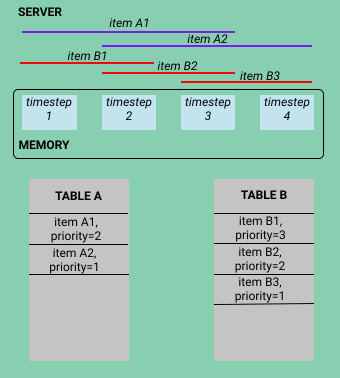

# Reverb

## Overview

Reverb is an efficient and easy-to-use data storage and transport system
designed for machine learning research. Reverb is most commonly used as a
prioritized experience replay system in distributed reinforcement learning
algorithms, but the system also supports other data structure representations
such as
[FIFO](https://en.wikipedia.org/wiki/FIFO_\(computing_and_electronics\))
and
[priority queues](https://en.wikipedia.org/wiki/Priority_queue).

## Installation

### Install using pip
TODO(b/155492840) Explain how to install with pip.

### Build from source
TODO(b/155494968): Explain how to build from source.

## Key Benefits

The key benefits of using Reverb (compared with built-in Python data structures
and other memory storage systems) are as follows:

*   Efficiency
    *   High performing C++ implementation
    *   Extremely fast sampling and update operations
    *   Memory-efficient storage
*   Usability
    *   Clean Python API
    *   Support for both queues and replay tables
    *   Custom TensorFlow operations for in-graph sampling, inserting, and
        updating
*   Consistency
    *   Support for single-process and distributed settings
    *   Controlled throughput via rate limiters for reduced impact of external
        conditions

## The Data Model

The above image demonstrates one of the key benefits of Reverb-- a
memory-efficient data model. Each timestep is only stored once on the server,
even if it is referenced by multiple items in a single priority table or by
multiple priority tables. Furthermore, the client only writes data to the server
when necessary.

## Reverb in Practice

This animation shows what the state of the server looks like at each step in the
code block. Although we are manually setting each item to have the same priority
value of 1.5, items do not need to have the same priority values (and, in
reality, will likely have differing and dynamically-calculated priority values).

For more examples of Reverb in practice, see [Code Examples](#code-examples).

## Further Customizations

Reverb can be customized according to the experiment's requirements. Common
customizations are as follows:

*   Creating multiple priority tables referencing the same underlying data
*   Modifying `sampler` to control the distributions used to select samples
*   Modifying `remover` to maintain a different set of items in full tables
*   Using `RateLimiter` to maintain balance between actors and learners
*   Limiting the number of times each item can be sampled using
    `max_times_sampled`

### Distributions

Reverb defines several types of distributions that can be used for sampling or
removing (when the table reaches maximum size) data from tables. Below is a 
brief overview of the available distributions.

NOTE: Some of these "distributions" are non-stochastic.

  *   [Prioritized](https://arxiv.org/abs/1511.05952): sample such that the probability of sampling an item is
      correlated to its specified priority value
      *   For more details about prioritized sampling and experience replay as
          used in research, see
          [Experience Replay in Research](#experience-replay-in-research)
  *   [MaxHeap](https://en.wikipedia.org/wiki/Heap_\(data_structure\)): sample
      the item with the highest priority. If multiple items share the same
      (highest) priority, select the most recently modified item
  *   [Uniform](https://en.wikipedia.org/wiki/Uniform_distribution): sample
      from all items with equal probability, thus ignoring priority
  *   [Lifo](https://en.wikipedia.org/wiki/LIFO): sample the newest item
  *   [Fifo](https://en.wikipedia.org/wiki/FIFO_\(computing_and_electronics\)):
      remove the oldest item
  *   [Lifo](https://en.wikipedia.org/wiki/LIFO): remove the newest item
  *   [MinHeap](https://en.wikipedia.org/wiki/Heap_\(data_structure\)): remove
      the item with the minimum priority (or the least recently
      inserted/updated if multiple items have this same priority)
  *   *Uniform*: remove from all items with equal probability

### Rate Limiters

`RateLimiters` are a powerful tool in making machine learning experiments more
robust by mitigating the impact of external factors on experiment results.
External factors could include noise such as changes in connection overhead or
hardware efficiency. By explicitly regulating the sampling rate, rate limiters
will ultimately lead to more robust and reproducible experiments.

The two rate limiters available are:

-   `MinSize`: only allows sampling when the table contains a minimum number of
    items
-   `SampleToInsertRatio`: controls throughput so that the number of times each
    item is sampled on average remains constant within the user-defined margin
    of error

Rate limiters block inserts and samples to maintain the desired ratio. This
behavior controls the rate that learners and actors are able to sample from and
insert into the replay buffer, regulating external factors such as the speed at
which the actor can take an environment step.

Consider the following scenario describing a SampleToInsertRatioLimiter with an
error buffer of 3.0 and a sample-to-insert ratio of 2:

One particular group of agent implementations, *single-threaded Python*, require
extra attention as they are prone to deadlocks caused by the RateLimiter's
blocking behavior. These risks do not exist in the distributed setting.

## Experience Replay in Research

Prioritized experience replay is one of the most common uses of Reverb. The
following papers present the relevant state of the art research:

*   [Prioritized Experience Replay](https://arxiv.org/abs/1511.05952)
*   [Distributed Prioritized Experience Replay](https://arxiv.org/abs/1803.00933)
*   Queue-based experience replay ([IMPALA](https://arxiv.org/abs/1802.01561)
    and [hybrid A3C](https://arxiv.org/abs/1611.06256))
*   [DQN](https://www.nature.com/articles/nature14236)

<!-- TODO(b/154938808): Add Code example(s) -->
